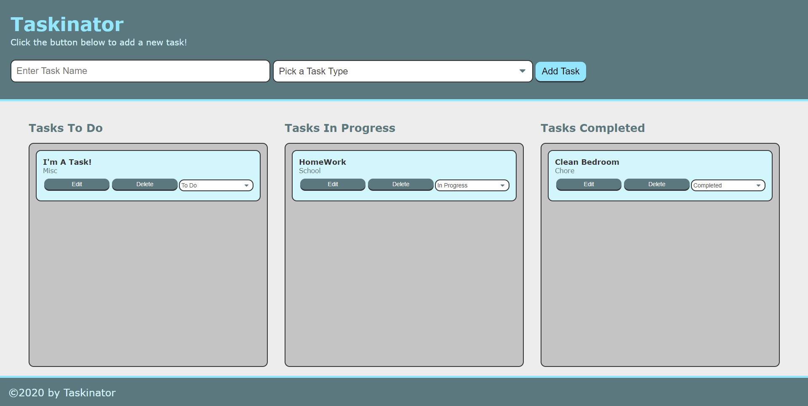

# Taskinator
Organize and track your busy list of tasks with this helpful application. You'll have a list for tasks you need **To-Do**, tasks that are **In-Progress**, and tasks that you've **Complete**. You can even edit or remove your tasks. Best of all, when you refresh or close and re-open this application, your tasks are still right where you left them.

## Description 
The top of the page has a form for you to create a new task.

Once the task is added, you can change it's status via the drop down option. This will move the task to it's respective status list: 
* To Do
* In Progress
* Completed

You can click on the **Edit** button to load the task BACK into the top form. From there, you can change the name or even the type of task it is. Once you've finished making changes, click the **Save Task** button to see the task updated.

Need to remove a task? Simply click the **Delete** button and it's gone **FOR** **EV** **ER**.

The application uses `localStorage` to save your task list. While this will save all their features including loading them back into the correct status list, you will not be able to access your list from a different device. 

## Screenshot

## Link
https://sirubu.github.io/taskinator/